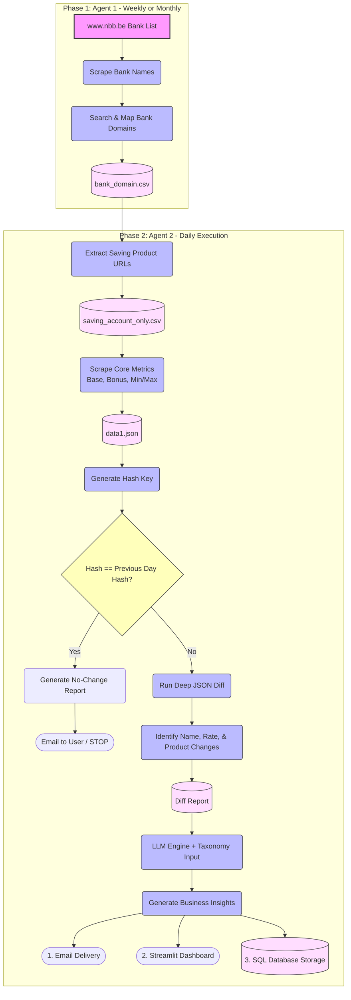

## mermaid practise file

```mermaid

graph TD
    %% Styling
    classDef external fill:#f9f,stroke:#333,stroke-width:2px;
    classDef process fill:#bbf,stroke:#333,stroke-width:1px;
    classDef storage fill:#fdf,stroke:#333,stroke-width:1px;
    classDef decision fill:#ffb,stroke:#333,stroke-width:1px;
    
    %% Phase 1: Agent 1
    subgraph P1 ["Phase 1: Agent 1 - Weekly or Monthly"]
        A[www.nbb.be Bank List] --> B(Scrape Bank Names)
        B --> C(Search & Map Bank Domains)
        C --> D[(bank_domain.csv)]
    end

    %% Phase 2: Agent 2
    subgraph P2 ["Phase 2: Agent 2 - Daily Execution"]
        D --> E(Extract Saving Product URLs)
        E --> F[(saving_account_only.csv)]
        F --> G(Scrape Core Metrics <br> Base, Bonus, Min/Max)
        G --> H[(data1.json)]
        H --> I(Generate Hash Key)
        I --> J{Hash == Previous Day Hash?}
        
        %% Decision Paths
        J -- Yes --> K(Generate No-Change Report)
        K --> L([Email to User / STOP])
        
        J -- No --> M(Run Deep JSON Diff)
        M --> N(Identify Name, Rate, & Product Changes)
        N --> O[(Diff Report)]
        
        %% LLM & Outputs
        O --> P(LLM Engine + Taxonomy Input)
        P --> Q(Generate Business Insights)
        
        Q --> R([1. Email Delivery])
        Q --> S([2. Streamlit Dashboard])
        Q --> T[(3. SQL Database Storage)]
    end

    class A external;
    class B,C,E,G,I,M,N,P,Q process;
    class D,F,H,O,T storage;
    class J decision;
```
